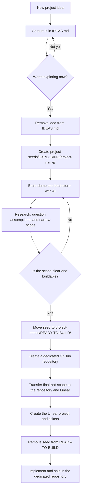

# Personal Notes

This repository is a home for the things I want to study, useful lessons I pick up, and project ideas I may eventually build.

## How it works

- [`STUDY.md`](STUDY.md) records my current learning focus and the topics I want to explore next.
- [`IDEAS.md`](IDEAS.md) is the inbox for every plausible project idea, including rough or incomplete ones.
- [`project-seeds/EXPLORING/`](project-seeds/EXPLORING/) contains ideas currently being brainstormed and scoped.
- [`project-seeds/READY-TO-BUILD/`](project-seeds/READY-TO-BUILD/) contains fully scoped ideas waiting to be transferred to Linear and a dedicated repository.
- [`gotchas/`](gotchas/) is the entry point for newly discovered lessons, surprises, and pitfalls.

## Project idea workflow



### Using the workflow

1. Capture an idea immediately in `IDEAS.md`. Do not wait for it to be polished.
2. When brainstorming begins, remove the idea from `IDEAS.md` and create a lowercase, hyphenated folder under `project-seeds/EXPLORING/`, such as `project-seeds/EXPLORING/offline-reading-list/`.
3. Add a `README.md` using the seed template in [`project-seeds/README.md`](project-seeds/README.md). Keep AI discussions, raw notes, research, decisions, and scope drafts together in that folder.
4. Refine the seed until its problem, audience, boundaries, and first version are unambiguous.
5. After completing the readiness checklist, move the entire seed folder from `EXPLORING/` to `READY-TO-BUILD/`.
6. Create a dedicated repository, transfer the finalized scope into it, and give that scope to Linear so it can become a project with actionable tickets.
7. After verifying the scope exists in the dedicated repository and Linear, remove the seed folder from `READY-TO-BUILD/`.
8. Keep implementation and all subsequent changes in the dedicated repository. Git history preserves the seed's earlier development in this repository.

## Repository map

```text
personal-notes/
├── README.md
├── STUDY.md
├── IDEAS.md
├── gotchas/
│   └── README.md
└── project-seeds/
    ├── README.md
    ├── EXPLORING/
    │   ├── README.md
    │   └── project-name/
    │       ├── README.md   # Scope, decisions, and readiness checklist
    │       └── notes.md    # Optional brain dumps or AI discussion summaries
    └── READY-TO-BUILD/
        ├── README.md
        └── project-name/   # Fully scoped and awaiting external handoff
```

## Maintenance rules

- Keep uncultivated ideas only in `IDEAS.md`; do not create a seed folder for every passing thought.
- An idea must exist in exactly one active location: `IDEAS.md`, `EXPLORING/`, or `READY-TO-BUILD/`.
- Keep each project seed self-contained and record conclusions from AI conversations, not just chat transcripts.
- Move a seed to `READY-TO-BUILD/` only when its scope and checklist are complete.
- Remove a ready seed only after its finalized scope has been safely transferred to both its dedicated repository and Linear.
- When the gotchas inbox becomes large enough, move related entries into thematic files inside that folder.

## GitHub synchronization

Changes are committed locally first. The Windows task **Personal Notes GitHub Sync** runs [`scripts/sync-to-github.ps1`](scripts/sync-to-github.ps1) once per hour to stage local changes, create a timestamped commit when necessary, and push `main` to GitHub.

- The sync never force-pushes and does not try to resolve remote conflicts automatically.
- If someone changes the GitHub repository directly, the scheduled push may fail safely until the local branch is reconciled.
- Its local activity log is stored outside this repository at `%LOCALAPPDATA%\PersonalNotesSync\sync.log`.

The repository intentionally starts with a simple Markdown-only structure. Topic ranking and further organization can be added as the collection grows.
