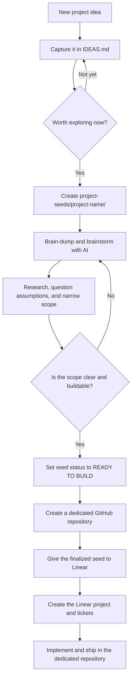

# Personal Notes

This repository is a home for the things I want to study, useful lessons I pick up, and project ideas I may eventually build.

## How it works

- [`STUDY.md`](STUDY.md) records my current learning focus and the topics I want to explore next.
- [`IDEAS.md`](IDEAS.md) is the inbox for every plausible project idea, including rough or incomplete ones.
- [`project-seeds/`](project-seeds/) contains active brainstorming for ideas I choose to explore.
- [`gotchas/`](gotchas/) is the entry point for newly discovered lessons, surprises, and pitfalls.

## Project idea workflow



### Using the workflow

1. Capture an idea immediately in `IDEAS.md`. Do not wait for it to be polished.
2. When an idea deserves focused exploration, create a lowercase, hyphenated folder under `project-seeds/`, such as `project-seeds/offline-reading-list/`.
3. Add a `README.md` to that folder using the seed template in [`project-seeds/README.md`](project-seeds/README.md). Keep AI discussions, raw notes, research, decisions, and scope drafts together in the seed folder.
4. Refine the seed until its problem, audience, boundaries, and first version are unambiguous.
5. Change the seed's status to `READY TO BUILD` only after completing its readiness checklist.
6. Create a dedicated repository for implementation. Give Linear the finalized seed so it can become a project with actionable tickets.
7. Keep implementation and subsequent changes in the dedicated repository. This repository remains the idea, learning, and early-thinking workspace.

## Repository map

```text
personal-notes/
├── README.md
├── STUDY.md
├── IDEAS.md
├── gotchas/
│   └── README.md
└── project-seeds/
    ├── README.md
    └── project-name/       # Created only when an idea is actively explored
        ├── README.md       # Status, scope, decisions, and readiness checklist
        └── notes.md        # Optional raw notes or AI discussion summaries
```

## Maintenance rules

- Keep uncultivated ideas in `IDEAS.md`; do not create a seed folder for every passing thought.
- Link an active idea in `IDEAS.md` to its seed folder so its current state is easy to find.
- Keep each project seed self-contained and record conclusions from AI conversations, not just chat transcripts.
- Treat `READY TO BUILD` as a deliberate handoff state, not a general sign of enthusiasm.
- When the gotchas inbox becomes large enough, move related entries into thematic files inside that folder.

The repository intentionally starts with a simple Markdown-only structure. Topic ranking and further organization can be added as the collection grows.
