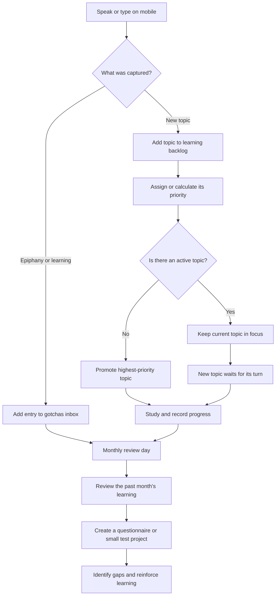

# Learning Tracker

## One-line summary

A mobile-friendly learning companion that captures new study topics and gotchas, protects focus on one active topic, and turns each month's learning into review questions or a small test project.

## Exploration documents

- [Mobile interface](mobile-interface.md) - index for the [ChatGPT POC](poc.md) and [dedicated Android application](dedicated-app.md).

## Problem

New technologies and ideas often appear faster than they can be learned. Capturing them is useful, but immediately switching to every new topic creates distraction and large jumps between unrelated subjects. At the same time, useful epiphanies and gotchas can be lost if recording them requires too much effort.

The tracker should make capture effortless while keeping learning deliberate: one topic receives primary attention, other topics wait in a prioritized queue, and past learning is revisited on a regular schedule.

## Intended workflow

## Example

1. I tell the tracker from my phone: “Add XYZ to my learning list.”
2. The tracker captures `XYZ` without replacing the topic I am currently studying.
3. `XYZ` is placed in the backlog according to the agreed priority rules.
4. When the active topic is complete or deliberately paused, the next eligible topic becomes the focus.
5. I can also say, “Gotcha: XYZ behaves differently when…” and the tracker records it in the gotchas inbox.
6. On a scheduled monthly review day, the tracker gathers that month's learning and helps produce questions or a small practical project.

## Proposed scope

### In scope

- Mobile-friendly capture of a new learning topic using natural language.
- Mobile-friendly capture of an epiphany, lesson, or gotcha.
- A learning backlog with exactly one active focus topic.
- A visible priority order for topics that are waiting.
- Explicit completion or pausing of the active topic before another is promoted.
- Storage compatible with the learning list and gotchas workflow in this repository.
- A monthly view of completed work and captured learnings.
- Generation of a short questionnaire or a small practice-project brief from the month's material.

### Out of scope for the first version

- Automatically mastering or completing learning material on the user's behalf.
- Full course hosting or video delivery.
- Social feeds, public leaderboards, or multi-user collaboration.
- Implementation inside this `personal-notes` repository; the finished project will receive a dedicated repository.

## Early product principles

- **Capture without distraction:** recording a new topic must not silently replace the active focus.
- **One primary focus:** only one topic is actively promoted at a time.
- **Explain the queue:** the user should be able to understand why a topic has its position.
- **Related steps over large leaps:** priority should consider how closely a candidate topic supports or follows the active learning path.
- **User control:** automatic suggestions may influence ordering, but the user must be able to override priority and select the next topic.
- **Review through recall and practice:** monthly review should test understanding, not merely summarize notes.

## Candidate data concepts

These are working concepts, not a finalized schema:

- **Learning topic:** title, capture date, priority, relationship to the current focus, state, and optional notes.
- **Active focus:** the single topic currently being learned.
- **Gotcha:** captured date, text, related topic, source or context, and optional tags.
- **Monthly review:** date range, included topics and gotchas, generated questions, answers, and optional practice project.

## Brain dump

- Mobile capture could begin as a simple text interface, voice transcription, phone shortcut, or chat-style assistant.
- The repository's `STUDY.md` and `gotchas/README.md` could be the initial source of truth, or the app could use its own structured storage and export Markdown.
- Priority may combine manual importance, prerequisites, similarity to the active topic, age in the backlog, and urgency.
- The tracker should avoid starvation: a less-related topic should eventually receive attention rather than waiting forever.
- Gotchas should first land in one inbox and be distributed into thematic files only when a future threshold or review process calls for it.
- Monthly review could create either a recall quiz, a coding exercise, a mini build, or a combination based on the kind of material learned.
- A fixed monthly review day could be configured with a reminder, but the delivery channel still needs to be chosen.

## Key decisions

- New topics enter a backlog and do not interrupt the current focus automatically.
- There is only one primary learning topic at a time.
- New epiphanies and lessons enter the gotchas inbox first.
- Monthly review covers the previous month's learning and produces active recall or practical work.
- Start with a long-press ChatGPT POC: dictate one short `Log this:` message to a private capture GPT in text mode, then classify it and create a GitHub pull request without requiring the user to name the category.
- Build a dedicated native Android app launched from the lock-screen Quick Corner only after the POC validates the workflow; it stores each capture locally before synchronizing to GitHub.
- This seed remains in `EXPLORING/` until the interfaces, prioritization behavior, storage model, and first-version boundary are finalized.

## Open questions

- Can the private capture GPT with a configured Action be opened quickly from the ChatGPT mobile experience after the side-button launch?
- Is Android dictation accurate enough for the short `Log this:` capture format?
- Which signals determine priority, and how should their relative weight be controlled?
- What does “complete” mean for a learning topic, and can a topic be paused or split into smaller topics?
- How should prerequisites and relationships between topics be represented?
- How should the monthly review day be scheduled and delivered?
- Should questions be generated only from the user's notes, or may external learning material also be used?
- Where should answers, scores, and completed test projects be retained?
- What privacy and authentication requirements apply to personal voice, notes, and learning history?

## Build-readiness checklist

- [x] The initial problem and intended user are identified.
- [x] The main idea-capture, focus, gotcha, and monthly-review workflows are described.
- [x] The POC and post-POC mobile interface paths are chosen.
- [x] The POC integration contract with `personal-notes` is decided: a GPT Action calls a backend that classifies a short capture and creates a pull request.
- [ ] The prioritization rules and user overrides are defined.
- [ ] Topic lifecycle and completion rules are defined.
- [ ] Monthly review generation and scheduling behavior are defined.
- [ ] Privacy, authentication, and storage constraints are defined.
- [ ] In-scope and out-of-scope boundaries for the first build are finalized.
- [ ] Important open questions are resolved.
- [ ] The work can be translated into Linear tickets.
- [ ] A dedicated repository name has been chosen.

## Handoff

- **Dedicated repository:** Not created
- **Linear project:** Not created
