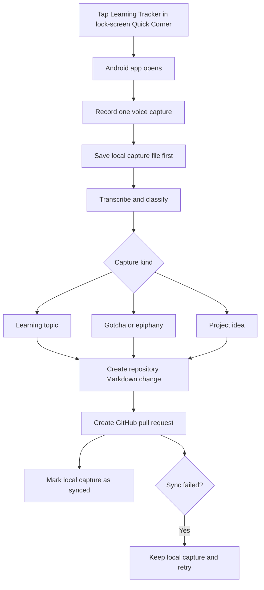

# Dedicated Android Application

Build this only after the [POC](poc.md) proves useful in everyday use.

## Intended interaction



## Local-first record

Before contacting a model or GitHub, save each capture in app-private storage:

```text
captures/
└── 2026-09-09T10-15-30Z-uuid.json
```

Each record contains the capture ID, timestamp, cleaned transcript, inferred type and confidence, Markdown payload, sync state (`pending`, `synced`, or `failed`), and GitHub pull-request URL after sync. Failed captures remain queued for retry.

The Android app contains no OpenAI or GitHub credentials. A backend owns transcription, classification, validation, GitHub authentication, and serialized repository writes.

## Synchronization rule

Start with pull requests as in the POC. A future opt-in auto-commit mode may be considered only after consistently correct, non-sensitive captures have been demonstrated.

## App-specific open questions

- How long should the app retain synced local capture files?
- What accuracy and weekly usage threshold should trigger the dedicated-app build?
- Should synced local captures be deleted automatically, archived locally, or exported by the user?
- What authentication method should protect the phone-to-backend connection?
- Should low-confidence captures use the same gotchas default as the POC, or first remain in a local review queue?
