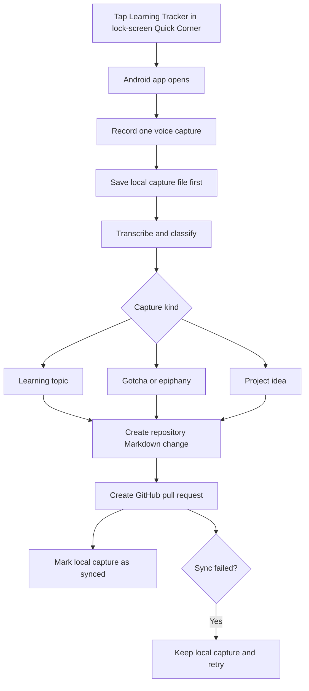

# Dedicated Android Application

~~Build this only after the [POC](poc.md) proves useful in everyday use.~~

**Current strategy: build the native Android application now.** The [ChatGPT POC](poc.md) is cancelled and retained only as historical context. The Android app is the sole implementation path.

## First-build boundary

The first release should deliver one reliable capture loop rather than every future learning feature at once:

- Capture one short spoken or typed thought from the app.
- Save the capture locally before any network request.
- Send a pending capture to an authenticated backend for transcription when needed, classification, Markdown generation, and a GitHub pull request.
- Infer `learning topic`, `gotcha / epiphany`, or `project idea` without asking the user to label it.
- Default low-confidence captures to gotchas and flag them for review.
- Show the local sync state and the resulting pull-request link.

The app will launch from the Samsung lock-screen Quick Corner after the user configures that system shortcut. It does not need to configure the shortcut itself.

## Intended interaction



## Local-first record

Before contacting a model or GitHub, save each capture in app-private storage:

```text
captures/
└── 2026-09-09T10-15-30Z-uuid.json
```

Each record contains the capture ID, timestamp, cleaned transcript, inferred type and confidence, Markdown payload, sync state (`pending`, `synced`, or `failed`), and GitHub pull-request URL after sync. Failed captures remain queued for retry.

The Android app contains no OpenAI or GitHub credentials. A backend owns transcription, classification, validation, GitHub authentication, and serialized repository writes.

## Synchronization rule

~~Start with pull requests as in the POC.~~ Start with pull requests in the native app. A future opt-in auto-commit mode may be considered only after consistently correct, non-sensitive captures have been demonstrated.

## Build-blocking decisions

- How long should the app retain synced local capture files?
- ~~What accuracy and weekly usage threshold should trigger the dedicated-app build?~~ **Resolved: begin the dedicated-app build now.**
- Should synced local captures be deleted automatically, archived locally, or exported by the user?
- What authentication method should protect the phone-to-backend connection?
- ~~Should low-confidence captures use the same gotchas default as the POC, or first remain in a local review queue?~~ **Resolved for the first build: default to gotchas and flag the capture for review.**

## Implementation order

1. Finalize the Android MVP data contract, retention policy, and authentication approach.
2. Create the dedicated Android repository and establish the Kotlin/Jetpack Compose app foundation.
3. Implement capture, local persistence, and an offline/retry queue.
4. Build the backend transcription, classification, validation, and GitHub PR pipeline.
5. Connect the app to the backend, expose sync state, and test the Quick Corner launch path.
6. Add learning-focus, prioritized backlog, and monthly-review features after the capture loop is stable.
