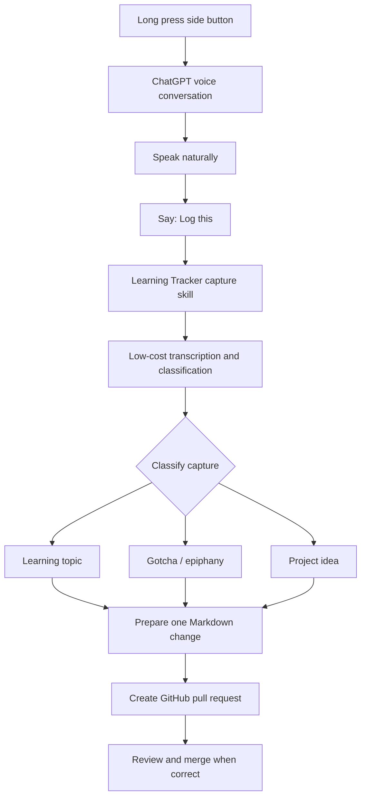
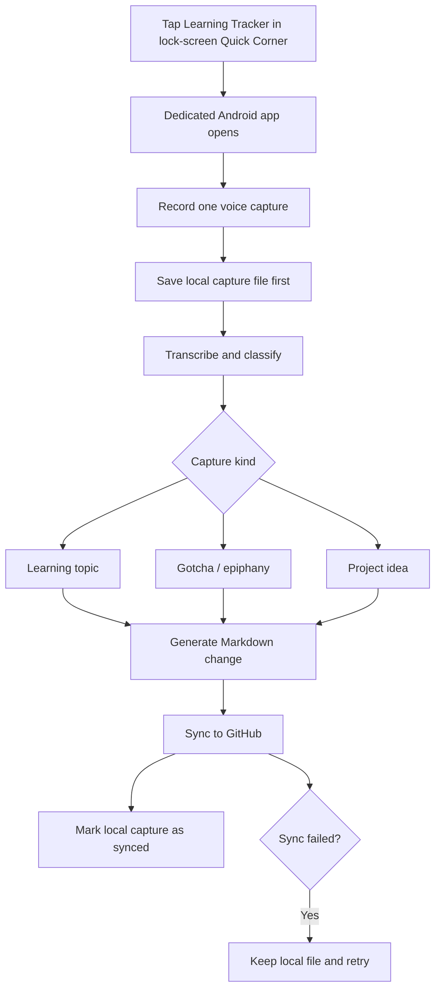

# Mobile Interface: POC Then Dedicated App

## Decision

Validate the workflow in two stages.

1. **POC:** Long press the Samsung side button to open ChatGPT. Speak naturally, then say one special phrase—recommended: **“Log this”**—to invoke a preconfigured Learning Tracker capture skill. It transcribes, classifies the capture without asking for its type, and creates a pull request in `personal-notes`.
2. **Dedicated app:** Build only after the POC is useful in daily life. Launch the app from the Galaxy S26 lock-screen Quick Corner. It records voice, saves a local capture file first, classifies it, and synchronizes it to GitHub.

There is no double-press shortcut in this design.

## Stage 1 — ChatGPT POC

The POC answers one question: **does frictionless voice capture, automatic classification, and a GitHub pull request fit naturally into daily life?** It is not a polished application.



The special phrase separates normal ChatGPT conversation from an intentional repository capture. You do **not** need to say “this is an idea” or “this is a gotcha”; the skill infers the category from meaning.

Alternative phrases worth testing are “Capture that” and “Save this learning.” Use one phrase consistently during the POC. `Log this` is the recommended default because it is short and neutral.

### Capture-skill contract

After the special phrase, the skill must:

1. Identify the relevant spoken content since the prior capture, or ask for a short summary if it cannot reliably find that boundary.
2. Use a low-cost model only for transcription cleanup, extraction, and classification.
3. Classify the entry as `learning_topic`, `gotcha_epiphany`, or `project_idea`.
4. Generate a concise title and a Markdown-ready entry.
5. Make one small change on one new branch and open one pull request.

It must not require a user-supplied category, push to `main`, merge the PR, upload raw audio, or include the whole ChatGPT discussion in the public repository.

### Destination rules

| Inferred type | Change in `personal-notes` |
| --- | --- |
| Learning topic | Append a timestamped entry to `STUDY.md` under **Topics to Explore**; never replace the current focus. |
| Gotcha / epiphany | Append a dated entry to `gotchas/README.md`. |
| Project idea | Append a structured entry to `IDEAS.md`. |

If confidence is low, create a PR marked `needs-classification-review`, explain the likely alternatives, and do not pretend the decision is certain.

### Why PRs are correct for the POC

`personal-notes` is public. A pull request lets you review classification and remove private material before publishing. It also creates a useful test record: each capture, proposed file, edit, and final outcome can be assessed when deciding whether to build the dedicated app.

### POC success criteria

Run the POC for two weeks using real life, not prepared examples.

- Capture at least 10 learning topics, 10 gotchas/epiphanies, and 5 project ideas.
- Measure classification accuracy after reviewing the PRs.
- Count entries that require meaningful edits before merging.
- Check that no new topic interrupts the active focus.
- Record whether `Log this` is memorable and whether it selects the intended part of a longer conversation.
- Evaluate whether PR review feels reassuring or too slow.

Graduate only if the workflow is used voluntarily several times per week and most captures are correctly classified with small corrections.

### POC capability to verify

The POC assumes that the configured ChatGPT side-button voice flow can invoke the capture skill and create a GitHub pull request. Those are the only capabilities to validate before treating this as the preferred capture workflow. If either is unavailable, preserve the same spoken interaction and use a small capture webhook in the dedicated-app stage.

## Stage 2 — Dedicated Lock-Screen App

Build this only if the POC proves that the capture habit and classification are valuable.



### Local-first capture

Before talking to a model or GitHub, save one small record in app-private storage:

```text
captures/
└── 2026-09-09T10-15-30Z-uuid.json
```

Each record contains the capture ID, timestamp, cleaned transcript, inferred type and confidence, Markdown entry, sync status (`pending`, `synced`, or `failed`), and the GitHub URL once available. A capture stays local until GitHub confirms success. Failed captures stay queued for retry.

### Synchronization policy

Begin with the same **pull-request-first** policy as the POC. If the measured POC accuracy is consistently high, add an explicit opt-in auto-commit mode later for short, non-sensitive captures. No credentials live on the phone: a small backend owns model access, GitHub authentication, validation, and serialized repository writes.

## Privacy rule

- Never upload raw audio by default.
- Put only the short cleaned capture—not the full conversation—in a PR.
- Never auto-merge POC PRs.
- If unattended publishing becomes important, write unreviewed captures to a private inbox repository and promote cleaned entries later.

## Post-POC build order

1. Local text capture plus a pending/synced queue.
2. Voice recording and transcription.
3. Automatic classification and Markdown generation.
4. GitHub PR creation and retry handling.
5. Offline, duplicate, and conflict testing.
6. Only then add the learning queue, active-focus controls, and monthly review features.

## Decision log

- **2026-09-09:** Replace the PWA/double-press proposal with a long-press ChatGPT POC.
- **2026-09-09:** Use `Log this` to invoke intentional capture without a user-supplied category.
- **2026-09-09:** Use low-cost transcription/classification and GitHub PRs for POC evaluation.
- **2026-09-09:** Make a native lock-screen Quick Corner app the next step only after the POC succeeds.

## Open questions

- What exact ChatGPT skill or integration configuration will invoke the POC capture flow?
- Can the POC reliably select the intended part of a longer voice conversation after “Log this”?
- Should a low-confidence capture use the most likely file or a separate private review queue?
- How long should the app retain synced local capture files?
- What accuracy and weekly usage threshold should trigger the dedicated-app build?
