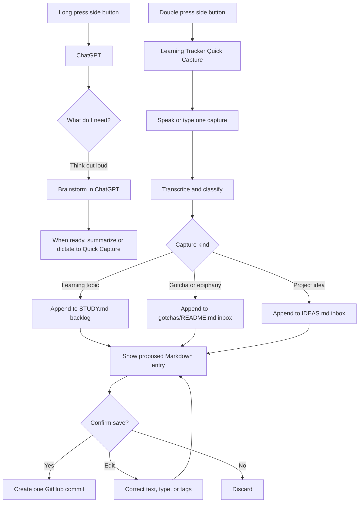
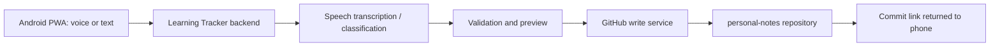

# Mobile Interface Decision

## Decision

Use a **two-speed mobile interface**:

1. **Long press side button → ChatGPT:** use this for conversation, exploration, and unstructured brainstorming.
2. **Double press side button → Learning Tracker Quick Capture:** use this for a fast spoken or typed capture that is classified, confirmed, and saved into the notes repository.

The Quick Capture surface will be a mobile-first web app (installable PWA) for the first version, backed by a small secure service. It should feel like a single-purpose voice note, not a full app to navigate.

This is the recommended first implementation. It preserves the best part of the original idea—frictionless voice capture—without making dependable GitHub writes rely on features inside ChatGPT Voice that may not be available in that context.

## Why this is better than a ChatGPT-only flow

ChatGPT remains the best place for an extended brainstorm. A dedicated capture surface is better for a short command such as “add Rust to my learning list” because it can provide a fixed, testable path from speech to the correct repository file.

| Need | ChatGPT from the side button | Learning Tracker Quick Capture |
| --- | --- | --- |
| Explore an idea conversationally | Primary experience | Can link out to ChatGPT if needed |
| Capture a topic or gotcha in seconds | Useful fallback | Primary experience |
| Classify a capture into a known destination | May require conversational follow-up | Fixed and testable contract |
| Update GitHub deterministically | Do not depend on this | Backend writes a controlled Markdown change |
| Show exactly what will be saved | Conversation transcript | Dedicated review card and commit result |

The ChatGPT Voice documentation currently says that custom actions are not available in Voice conversations with GPTs. OpenAI also describes the standard GitHub connection as a way to retrieve repository data. These are poor foundations for the core write path. The tracker should therefore own its capture-to-GitHub integration. [ChatGPT Voice](https://help.openai.com/en/articles/20001274/), [GitHub in ChatGPT](https://help.openai.com/en/articles/11145903-connecting-github-to-chatgpt-deep-research)

## Intended experience

### Example commands

- “Topic: learn Rust. It is relevant to systems programming.”
- “Gotcha: TypeScript narrows this variable only inside the callback.”
- “Idea: a reading assistant that turns saved articles into spaced-repetition prompts.”
- “Note for the active topic: I finally understand event loops.”

The classifier should accept natural language rather than require the prefixes above. Prefixes are useful as an optional power-user shortcut.

## Capture contract

The first version accepts one capture per interaction and produces one of these outcomes:

| Type | Repository destination | Minimum saved fields |
| --- | --- | --- |
| Learning topic | `STUDY.md` | title, capture date, optional context |
| Gotcha / epiphany | `gotchas/README.md` | date, summary, optional related topic/context |
| Project idea | `IDEAS.md` | title, capture date, problem or opportunity, optional rationale |
| Active-topic note | active topic record or a later topic-notes file | date, note text |

The tracker must not change the active study topic merely because a new topic was captured. Queue ordering and promotion are separate actions.

## Confirmation and privacy rule

`personal-notes` is public. Spoken captures can accidentally include private names, work details, credentials, or half-formed personal thoughts.

For that reason, the default is **voice confirmation before a public commit**:

1. The app displays and speaks back a compact summary: “Save this as a gotcha in personal-notes?”
2. You answer “yes,” tap Save, or edit it.
3. The service commits only the reviewed text; it does not store raw audio by default.

An opt-in **auto-save mode** may later bypass confirmation for short topic captures. It should never be the default for a public repository, and it should be possible to turn off immediately.

If you want true no-review capture for every thought, use a private capture inbox first and publish cleaned entries to `personal-notes` during review. That is a later enhancement, not part of the first version.

## Technical shape for the first version

- **Mobile client:** installable responsive web app. It opens quickly through the Samsung side-button app shortcut and can use text input when voice is inconvenient.
- **AI layer:** use the OpenAI API for transcription and structured classification. A real-time voice experience can be added later; the initial flow only needs reliable capture, transcription, and a short response.
- **Backend:** a small service that holds credentials, validates the proposed entry, reads the latest target file, and serializes writes to avoid conflicting commits.
- **GitHub credential:** use a GitHub App installed only on `parjanay/personal-notes` with the minimum contents-write permission. GitHub recommends Apps rather than long-lived personal tokens for long-lived integrations, and its Contents API can create or update files with scoped write credentials. [GitHub credential guidance](https://docs.github.com/en/authentication/keeping-your-account-and-data-secure/managing-your-personal-access-tokens), [Contents API](https://docs.github.com/en/rest/repos/contents)
- **No secrets on the phone:** the app authenticates to the backend; the GitHub credential and OpenAI API key remain server-side.

## Scope boundary for the first build

Build this in three thin slices:

1. **Text capture:** choose Topic, Gotcha, or Idea; preview; then append a Markdown entry and return a GitHub commit link.
2. **Voice capture:** add transcription and automatic type suggestion, while preserving preview-and-confirm.
3. **Learning intelligence:** add the single active topic, backlog ordering, completion/pause controls, and monthly review generation.

This sequencing proves the repository integration before adding voice, AI classification, and prioritization complexity all at once.

## Alternatives considered

### ChatGPT-only capture

Keep all capture inside the ChatGPT conversation and ask it to write to GitHub.

- **Strength:** closest to the original mental model and excellent for discussions.
- **Weakness:** write behavior depends on the ChatGPT experience, plan, configuration, and action availability; it is not the most stable core integration for a personal tracker.
- **Use:** retain as the brainstorming path, not the sole ingestion mechanism.

### Native Android app first

Build a dedicated Android application with deeper device integration.

- **Strength:** best long-term shortcut, notifications, offline queue, and voice behavior.
- **Weakness:** significantly more development before validating whether the workflow itself is useful.
- **Use:** a future upgrade once the PWA capture loop is used consistently.

### Private inbox repository first

Automatically write every unreviewed voice capture to a private repository, then promote selected entries to the public notes repository.

- **Strength:** safest form of true auto-save.
- **Weakness:** adds a second store and a promotion workflow.
- **Use:** add if public-repository confirmation feels too disruptive or captures often contain sensitive context.

## Validation plan

Before building beyond the first slice, test the daily interaction manually for one week:

- Capture at least five topics, five gotchas, and three project ideas from the phone.
- Check that every capture reaches the correct Markdown file and stays readable on GitHub.
- Measure whether preview-and-confirm feels acceptable or whether a private inbox is needed.
- Record every misclassification and unclear spoken phrase.
- Verify that a new topic never interrupts the active focus without an explicit user action.

## Decision log

- **2026-09-09:** Choose PWA Quick Capture plus a small backend as the first mobile interface.
- **2026-09-09:** Keep side-button ChatGPT as the long-form brainstorming interface.
- **2026-09-09:** Require review before committing to the public repository by default.
- **2026-09-09:** Start with text capture, then voice, then prioritization and monthly review.

## Open questions remaining

- Should the PWA use a login link, passkey, or an Android-only shared secret for backend authentication?
- Do you prefer an explicit type selector before speaking, or automatic classification after speaking?
- Should a ChatGPT conversation be exportable directly into a project seed once an idea becomes substantial?
- Is `personal-notes` intended to remain public once mobile voice capture begins, or should raw captures start in a private inbox?
- Which hosting provider should run the small backend?
