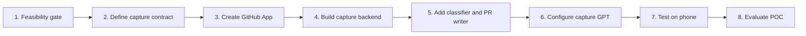

# ChatGPT POC Implementation Tasks

Work through these tasks in order. Do not build the backend until Task 1 confirms that your ChatGPT account can actually host the required capture action.

## 1. Confirm the ChatGPT route

**Goal:** prove that the proposed ChatGPT surface can invoke an Action.

- [ ] On ChatGPT web, check whether you can create or edit a private custom GPT.
- [ ] Check whether the GPT editor exposes **Actions** and can add an OpenAPI schema.
- [ ] Confirm that the same private GPT can be opened from the Android ChatGPT app.
- [ ] Confirm that Android keyboard dictation can create a text message in that GPT chat.

**Done when:** you can use an editable private GPT with Actions on web and open it on the phone.

**Stop condition:** if your account cannot create or edit a GPT with Actions, do not continue with this ChatGPT POC. Official OpenAI guidance says personal accounts cannot create new GPTs; mobile supports using GPTs but not building them. In that case, use the dedicated-app route instead or obtain an eligible managed workspace. [Creating and editing GPTs](https://help.openai.com/en/articles/8554397)

## 2. Define the one-capture API contract

**Goal:** make the GPT Action and backend agree on one small, testable request.

- [ ] Define `POST /captures`.
- [ ] Accept only `captureText`, a short string following `Log this:`.
- [ ] Return `classification`, `confidence`, `pullRequestUrl`, and `status`.
- [ ] Define the allowed classifications: `learning_topic`, `gotcha_epiphany`, and `project_idea`.
- [ ] Define a low-confidence result that defaults to `gotcha_epiphany` and includes `needsClassificationReview: true`.

**Done when:** a request and response example are written in the backend API specification.

## 3. Create a narrowly scoped GitHub integration

**Goal:** give the backend permission to create branches, commits, and pull requests only in `parjanay/personal-notes`.

- [ ] Create a GitHub App rather than using a token embedded in the phone or GPT.
- [ ] Install it only on `parjanay/personal-notes`.
- [ ] Grant only the contents and pull-requests permissions needed to create a branch, commit one file, and open a PR.
- [ ] Store the App credentials in the backend's secret manager.
- [ ] Test a harmless branch and PR created by the backend identity.

**Done when:** the backend can create a test PR without access to any other repository.

## 4. Scaffold the capture backend

**Goal:** expose a secure endpoint that a GPT Action can call.

- [ ] Create a small service with `POST /captures` and `GET /health`.
- [ ] Add Action authentication, using a secret header or another server-to-server mechanism.
- [ ] Reject missing, oversized, or empty capture text.
- [ ] Log only capture ID, status, and error category; do not log raw private captures by default.
- [ ] Return clear errors that the GPT can show without exposing internals.

**Done when:** an authenticated local test request receives a valid response shape.

## 5. Implement classification and Markdown generation

**Goal:** convert one short capture into a safe, structured repository entry.

- [ ] Send `captureText` to a low-cost OpenAI API model with structured output.
- [ ] Require title, concise summary, classification, confidence, and optional context.
- [ ] Validate the response before any GitHub call.
- [ ] Map learning topics to `STUDY.md`, gotchas to `gotchas/README.md`, and ideas to `IDEAS.md`.
- [ ] Map low-confidence captures to `gotchas/README.md` and add a review note in the PR description.
- [ ] Ensure a new topic never changes the active learning focus.

**Done when:** automated examples produce valid Markdown for one example of each category and one ambiguous example.

## 6. Implement branch and pull-request creation

**Goal:** turn the generated entry into one reviewable GitHub PR.

- [ ] Read the latest version of the selected target file.
- [ ] Append exactly one dated Markdown entry in the existing format.
- [ ] Create a branch named `capture/<capture-id>`.
- [ ] Commit only the target Markdown file.
- [ ] Open a PR titled with the inferred category and generated title.
- [ ] Include the classification, confidence, and review note in the PR description.
- [ ] Handle branch-name collisions and file-update conflicts without touching `main`.

**Done when:** a backend test creates a PR for each destination file and no direct commit reaches `main`.

## 7. Configure the private capture GPT

**Goal:** make `Log this:` invoke the backend exactly once.

- [ ] Create the `Personal Notes Capture` GPT on ChatGPT web.
- [ ] Add the `POST /captures` OpenAPI schema under **Actions**.
- [ ] Configure the Action authentication to match the backend.
- [ ] Add these instructions:
  - Act only when the message begins with `Log this:`.
  - Treat everything after the prefix as one short capture.
  - Do not ask for a category.
  - Call the Action once.
  - Reply with the inferred category and PR URL.
- [ ] Test the Action in the GPT Preview before using the phone.

**Done when:** a typed `Log this:` message produces one valid test PR.

## 8. Test the mobile capture loop

**Goal:** confirm the real interaction works from the Galaxy S26.

- [ ] Long press the side button and open the private capture GPT.
- [ ] Use Android keyboard dictation, not ChatGPT Voice mode.
- [ ] Test one topic, one gotcha, one project idea, and one ambiguous statement.
- [ ] Confirm the ambiguous statement creates a gotchas PR marked for review.
- [ ] Confirm the result message links to the expected PR.
- [ ] Confirm the raw audio and full ChatGPT conversation are not added to GitHub.

**Done when:** all four cases produce the expected pull requests from the phone.

## 9. Run and evaluate the POC

**Goal:** collect evidence before deciding to build the dedicated application.

- [ ] Use the POC for two weeks with real short captures.
- [ ] Record each PR's inferred category, final category, and whether editing was required.
- [ ] Record missed captures, duplicate PRs, and failed dictation.
- [ ] Decide whether pull-request review is acceptable for public notes.
- [ ] Review the dedicated-app questions in [dedicated-app.md](dedicated-app.md) only after this evidence exists.

**Done when:** you have a clear record of how the workflow behaves in daily life and can make an evidence-based decision about the dedicated app.
