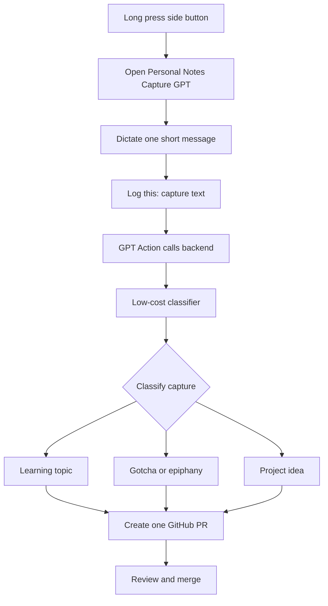

# ChatGPT Capture POC

## Goal

Test whether one short spoken thought can become a correctly classified GitHub pull request with minimal friction. This POC is not a brainstorming workflow.

## Voice invocation: the workable path

Official OpenAI documentation states that custom actions are unavailable in ChatGPT Voice conversations with GPTs. A phrase in a normal ChatGPT Voice conversation therefore cannot directly invoke a custom GPT Action or create a GitHub pull request. [ChatGPT Voice](https://help.openai.com/en/articles/20001274)

Use this POC path instead:

1. Long press the Samsung side button to open ChatGPT.
2. Open the private `Personal Notes Capture` custom GPT in **text mode**.
3. Use Android keyboard dictation to speak one message beginning with `Log this:`.
4. The GPT recognizes the marker and calls its configured Action.
5. The Action calls a small backend, which uses a low-cost model to classify the text and creates a GitHub pull request.

This is still voice-first, but the voice is converted to one dictated text message rather than sent through a live ChatGPT Voice conversation. ChatGPT supports GPT Actions that call external APIs, subject to account, plan, and workspace availability. [GPTs in ChatGPT](https://help.openai.com/en/articles/8554407-gpts-in-chatgpt.), [Configuring GPT Actions](https://help.openai.com/en/articles/9442513-gpt-actions-domain-settings-chatgpt-enterprise)

## Interaction



## Invocation and action contract

Use exactly this format:

```text
Log this: I learned that a TypeScript variable is narrowed only inside this callback.
```

`Log this:` is a capture marker, not a category label. The GPT instructions must:

- Act only on messages beginning with `Log this:`.
- Treat the remainder as one independent, short capture.
- Never ask the user to choose a category.
- Call the capture Action exactly once.
- Return the inferred type and created pull-request URL.

The backend endpoint receives the text, uses a low-cost model for structured classification and Markdown generation, then creates one branch and one PR. It never pushes to `main` or merges the PR. GitHub and OpenAI credentials remain server-side.

## Classification rules

| Inferred type | Repository change |
| --- | --- |
| Learning topic | Append a timestamped entry to `STUDY.md` under **Topics to Explore**; never change the active focus. |
| Gotcha / epiphany | Append a dated entry to `gotchas/README.md`. |
| Project idea | Append a structured entry to `IDEAS.md`. |
| Low confidence | Default to `gotchas/README.md`; state `needs classification review` in the PR description. |

Defaulting uncertain captures to gotchas keeps the thought without inventing a category. The PR is the correction point.

## Setup checklist

- [ ] Create or configure the private `Personal Notes Capture` custom GPT.
- [ ] Add the `Log this:` marker instructions.
- [ ] Build and host the capture backend endpoint.
- [ ] Add its OpenAPI schema as the GPT Action.
- [ ] Install a narrowly scoped GitHub App for `parjanay/personal-notes`.
- [ ] Test one learning topic, gotcha, project idea, and ambiguous capture.
- [ ] Confirm every result is a PR, never a direct `main` change.

## POC questions

- Does your ChatGPT account allow a custom GPT with an Action?
- Can the private capture GPT be opened quickly after the side-button launch?
- Is Android dictation accurate enough for the short `Log this:` format?
